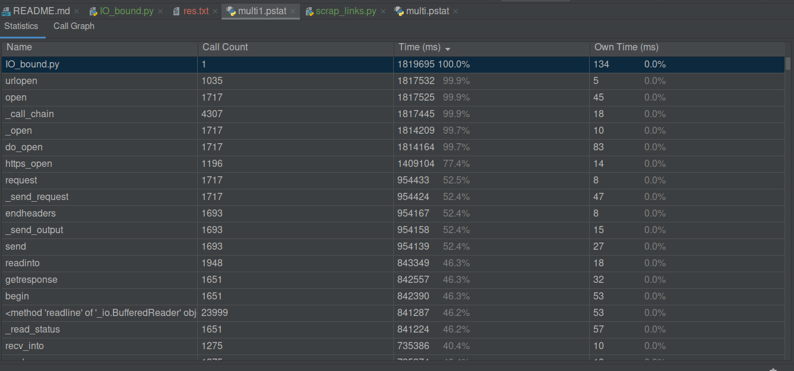
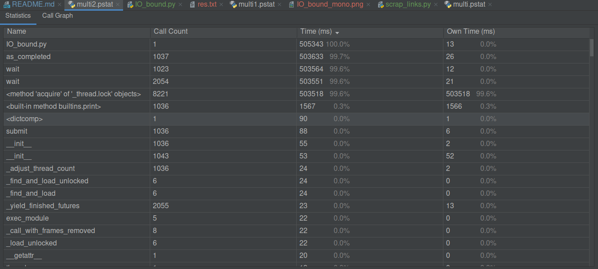
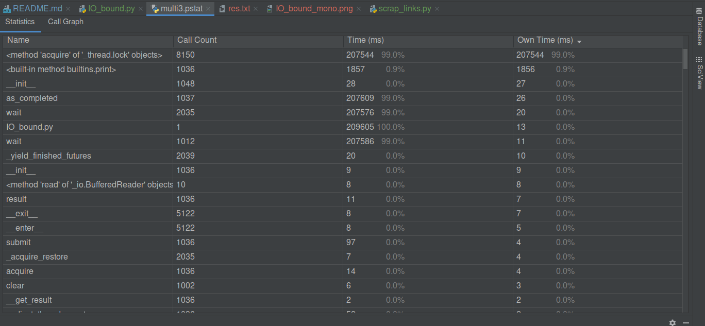
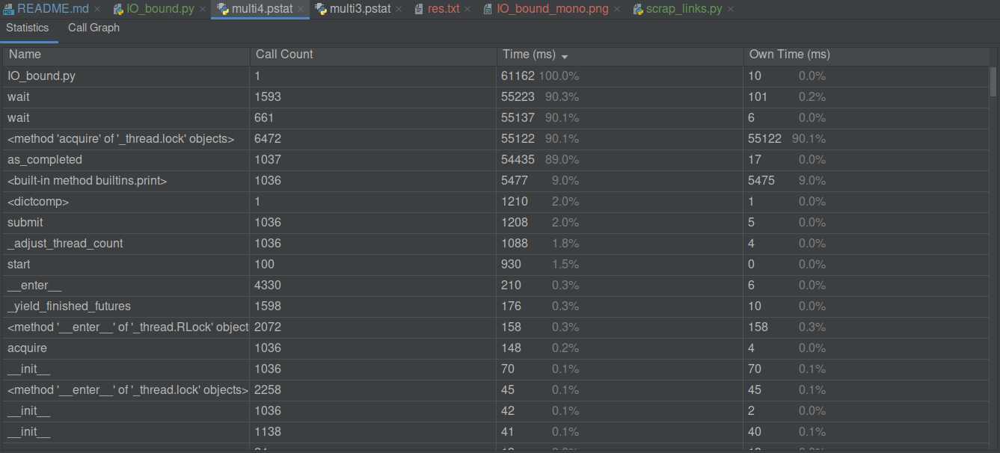
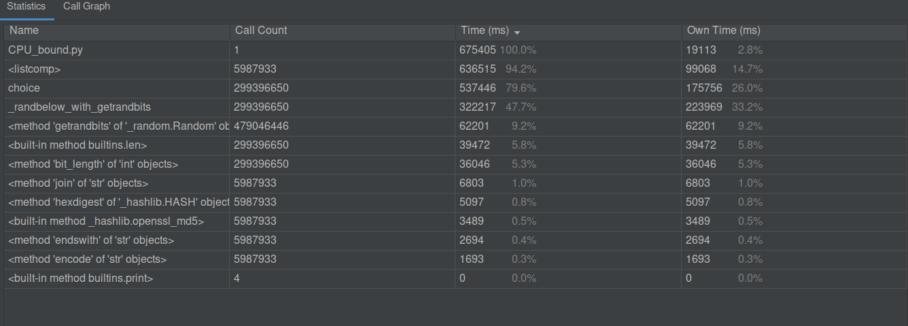
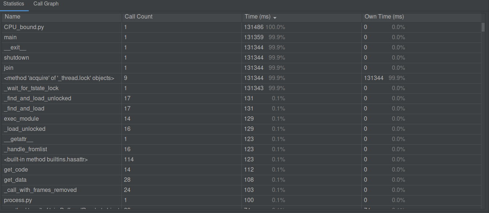
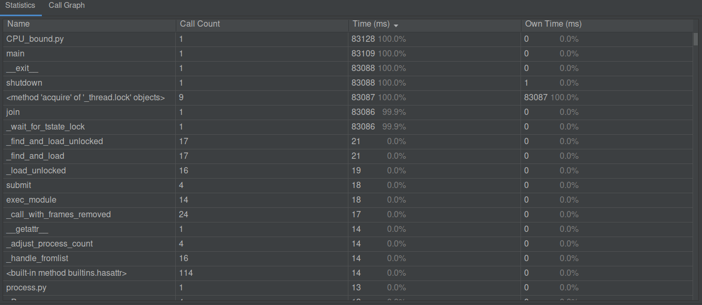
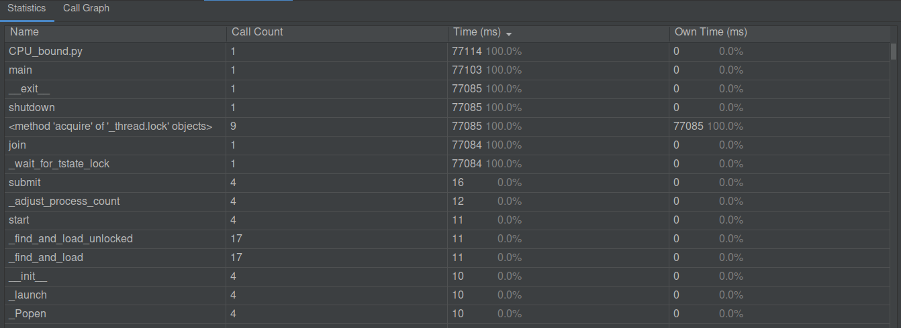

## Работа `IO_bound.py` в одном потоке

Работало целых полчаса
## В нескольких потоках:
### 5:

### 10:

### 100:

Чем больше у нас воркеров, тем быстрее выполняется задача, и тем больше используется ресурсов: процессор, память, сеть...

## Работа `CPU_bound.py` в одном потоке
Я переписал программу так, чтобы она завершалась на 4-х сгенерированных монетах

## Несколько потоков
### 2:

### 4:

Дальше определённо бесполезно ставить больше, чем мои 4 ядра, мой процессор загружен на 100%
### 10:

С увеличением количества задействованных ядер растёт загрузка процессора и памяти, а время работы в среднем уменьшается.
Сеть, как ни странно, тут вообще не используется, так что она никак не загружена в любом случае.
Как можно заметить, наращивать количество воркеров больше количества ядер (у меня 4) бесполезно.